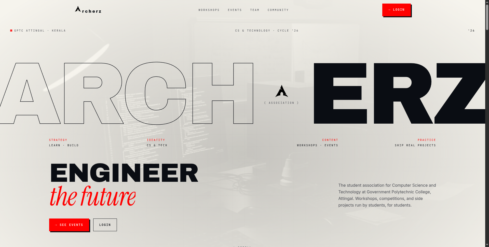
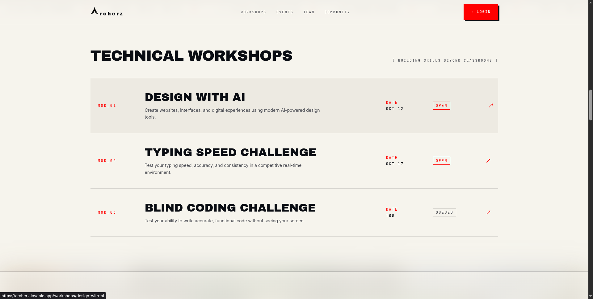
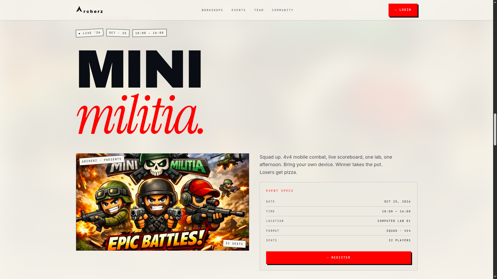
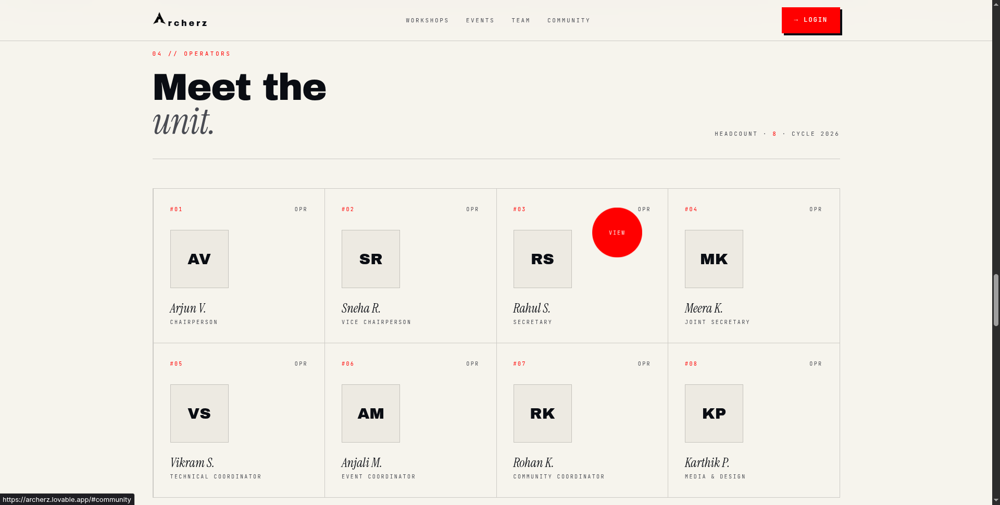
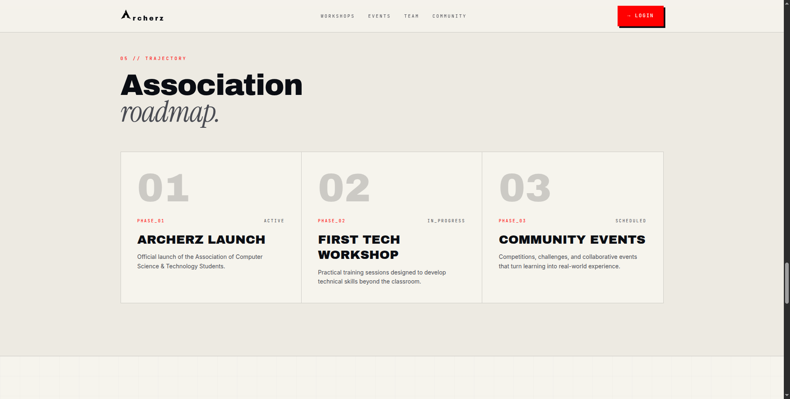

<div align="center">

# ARCHERZ

### Engineer the Future.

Official website of the **Computer Science & Technology Students' Association**  
**Government Polytechnic College, Attingal**

<p>
  <a href="https://archerz.vercel.app">
    
  </a>
  <a href="https://github.com/irfanahmed0019/archerz">
    
  </a>
  
  
</p>

</div>

---

## 📖 About

ARCHERZ is the official digital platform for the **Computer Science & Technology Students' Association** of Government Polytechnic College, Attingal.

The website is designed with a modern editorial-inspired interface that highlights workshops, technical events, competitions, community activities, and student engagement while maintaining a premium visual experience across desktop and mobile devices.

---

# 📸 Project Preview

## 🏠 Landing Page

<p align="center">
  
</p>

---

## 🛠 Technical Workshops

<p align="center">
  
</p>

---

## 🎮 Featured Event

<p align="center">
  
</p>

---

## 👥 Team Section

<p align="center">
  
</p>

---

## 🗺 Association Roadmap

<p align="center">
  
</p>

---

## 📬 Contact & Footer

<p align="center">
  
</p>

---

# ✨ Features

- 🎨 Editorial-inspired premium UI
- 📱 Fully responsive desktop and mobile design
- ⚡ Fast performance with Vite
- 🎭 Smooth animations and transitions
- 🛠 Technical workshop showcase
- 🎮 Event showcase and registration layout
- 👥 Team presentation
- 🗺 Association roadmap
- 📬 Contact form
- 📖 Modern typography and grid layouts
- ♿ Accessible and responsive interface

---

# 🛠 Tech Stack

### Frontend

- React
- TypeScript
- Vite
- TanStack Router
- Tailwind CSS
- shadcn/ui
- Framer Motion

### Backend

- Supabase

### Deployment

- Vercel

---

# 📂 Project Structure

```text
archerz
├── public
├── screenshots
├── src
│   ├── assets
│   ├── components
│   ├── hooks
│   ├── lib
│   ├── routes
│   ├── styles
│   └── utils
├── supabase
├── package.json
└── vite.config.ts
```

---

# 🚀 Getting Started

### Clone the repository

```bash
git clone https://github.com/irfanahmed0019/archerz.git
```

### Navigate to the project

```bash
cd archerz
```

### Install dependencies

```bash
npm install
```

### Start development server

```bash
npm run dev
```

### Build for production

```bash
npm run build
```

### Preview production build

```bash
npm run preview
```

---

# ⚙ Environment Variables

Create a `.env` file in the project root.

```env
VITE_SUPABASE_URL=your_supabase_url
VITE_SUPABASE_ANON_KEY=your_supabase_anon_key
```

---

# 🎨 Design Philosophy

The design focuses on simplicity, readability, and visual impact.

Core principles include:

- Large editorial typography
- Minimal color palette
- Strong whitespace
- Grid-based layouts
- Motion-driven interactions
- Responsive-first design
- Premium user experience
- Accessibility-focused interface

---

# 📱 Responsive Design

Optimized for:

- 📱 Mobile
- 📱 Tablets
- 💻 Laptops
- 🖥 Desktop
- 🖥 Large Displays

---

# 📌 Current Features

- Landing page
- About section
- Workshop listings
- Featured event page
- Team showcase
- Roadmap timeline
- Contact form
- Responsive navigation
- Mobile-first layouts
- Smooth scrolling
- Interactive animations

---

# 🔮 Future Improvements

- User Authentication
- Admin Dashboard
- Event Registration System
- Workshop Management
- Member Portal
- Blog
- Gallery
- Certificates
- Push Notifications
- Dark Mode
- CMS Integration

---

# 🤝 Contributing

Contributions are welcome.

1. Fork the repository

2. Create a feature branch

```bash
git checkout -b feature/new-feature
```

3. Commit your changes

```bash
git commit -m "Add new feature"
```

4. Push the branch

```bash
git push origin feature/new-feature
```

5. Open a Pull Request

---

# 📄 License

This project was developed for the **Computer Science & Technology Students' Association** of **Government Polytechnic College, Attingal**.

---

# 👨‍💻 Author

### Irfan Ahammad J

- GitHub: https://github.com/irfanahmed0019
- Portfolio: *(Add your portfolio URL here)*
- LinkedIn: *(Add your LinkedIn URL here)*

---

# 🙏 Acknowledgements

Special thanks to the amazing open-source community.

- React
- TypeScript
- Vite
- Tailwind CSS
- shadcn/ui
- TanStack Router
- Framer Motion
- Supabase
- Vercel

---

<div align="center">

## ⭐ If you like this project, consider giving it a star.

### ARCHERZ • Learn • Build • Innovate

**Engineer the Future.**

</div>
